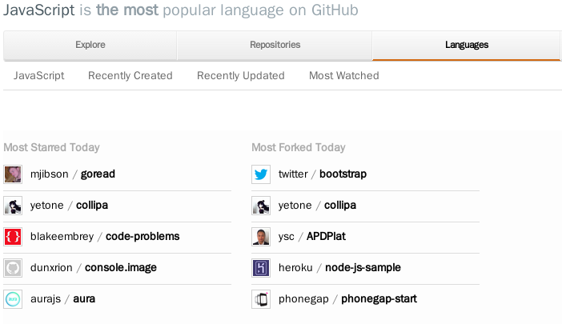

# The frontend development trends

### 瞎扯淡...


## Javascript 

> [Atwood's Law](http://www.codinghorror.com/blog/2009/08/all-programming-is-web-programming.html): any application that can be written in JavaScript, will eventually be written in JavaScript.





## Top 10
- bootstrap
> Sleek, intuitive, and powerful front-end framework for faster and easier web development.
- node
> evented I/O for v8 javascript
- jquery
> jQuery JavaScript Library


- html5-boilerplate
> A professional front-end template for building fast, robust, and adaptable web apps or sites.
- impress.js
> It's a presentation framework based on the power of CSS3 transforms and transitions in modern browsers and inspired by the idea behind prezi.com.
- d3
> A JavaScript visualization library for HTML and SVG.


- backbone
> Give your JS App some Backbone with Models, Views, Collections, and Events
- chosen
> Chosen is a library for making long, unwieldy select boxes more friendly.
- foundation
> The most advanced responsive front-end framework in the world. Quickly create prototypes and production code for sites and apps that work on any kind of device.
- three.js
> JavaScript 3D library.


- jQuery-File-Upload
> File Upload widget with multiple file selection, drag&amp;drop support, progress bar, validation and preview images, audio and video for jQuery. Supports cross-domain, chunked and resumable file uploads. Works with any server-side platform (Google App Engine, PHP, Python, Ruby on Rails, Java, etc.) that supports standard HTML form file uploads.
- angular.js
- brackets
> An open source code editor for the web, written in JavaScript, HTML and CSS.


- express
> Sinatra inspired web development framework for node.js -- insanely fast, flexible, and simple
- Modernizr
> Modernizr is a JavaScript library that detects HTML5 and CSS3 features in the user’s browser.
- meteor
> Meteor, an ultra-simple, database-everywhere, data-on-the-wire, pure-Javascript web framework.


- reveal.js
> The HTML Presentation Framework
- socket.io
> Realtime application framework for Node.JS, with HTML5 WebSockets and cross-browser fallbacks support.
- less.js
> Leaner CSS
- underscore
> JavaScript's utility _ belt


- jquery-mobile
> jQuery Mobile Framework
- moment
> Parse, validate, manipulate, and display dates in javascript.
- jquery-ui
> The official jQuery user interface library.
- ember.js
> Ember.js - A JavaScript framework for creating ambitious web applications
- select2
> Select2 is a jQuery based replacement for select boxes. It supports searching, remote data sets, and infinite scrolling of results.
- jquery-pjax
> pushState + ajax = pjax
-


## 前沿

    有趣..解决问题(引入新问题..)

## 基础

    通用..


## 瞎扯: 模块化
- 不重造 *麻烦* 的轮子
- 大型前端应用带来了更丰富的前端体验
- 引入了前端代码的组织问题


### [CommonJS](http://requirejs.org/docs/commonjs.html)
-  一个规范
- [众多实现](http://addyosmani.com/writing-modular-js/)
- 小教堂与大集市


### script loader to module loader
- 从解决加载阻塞问题到更好的模块化组织
- requirejs, broswerfy
- 新问题: 更多的小文件，增大http请求数，需要压缩


## 瞎扯: 异步编程
- node.js解决了js的服务端编程，提供了新的运行环境
- 引入更多的异步编程需求场景, 导致了callback hell
- 解决方案

    - promise(future) <- jquery(monad)
    - pubsub <- react  pattern
    - yield(coroutine) <- new feature


## 扯: 函数式
- javascript支持良好的编程范式
- function as first class
- closure support


## lambda演算
- 数学基础


## curry/partial function
- reference transparency
- higher-order function
- point-free style


## 扯: 元编程
- 强大的编程思想
- 反射
- 动态增加方法
- method_missing
```
firefox: obj.__noSuchMethod__ = fun
ES6(node --harmony): Proxy
```


- XMLBuilder


## 瞎扯: 解析
- 语法改进，模板优化，代码美化


### [正则表达式](http://tech.pro/tutorial/1214/javascript-regular-expression-enlightenment)
- parse: computer way to read something
- regexp: computer parse tool


### Jison/peg.js
- CFG/PEG解析
- 自动机


## 扯: 语法糖
- [sweet.js](http://sweetjs.org/)
- [altJS](http://altjs.org/)


## 瞎扯: 编译
- less, sass, stylus等预处理解决CSS的一系列问题
- coffeescript(altJS)弥补了js的一些问题(the javascript good parts, weak typing..?)
- 新玩法
    - emscripten: llvm IR -> asm.js


## 扯: MV*富客户端框架
- 结构: backbone, spine, batman..
- html extending(bidirect binding): knockout, ember.js, angular.js, react


## 扯: TDD敏捷开发
- 弱类型动态语言，测试添加项目可靠性
- 前端需求多变, 杂乱，无测试传统


## 扯: 集成化工作流
- 众多的编译语言带来了代码书写的舒适，但是导致了更多的中间任务处理
- 集成化的工作流，处理CSS sprite， 代码编译，压缩等一系列任务..
- [yeoman workflow](http://yeoman.io/)


## 瞎扯: 性能
- 更好的用户体验，更强大的前端框架，引入了更多的内存消耗
- 解决方案
    - 更好的浏览器引擎
        - 基于栈到基于寄存器
        - 类型优化(type inference)
        - 隐式对象(v8 tricks)
    - 好性能的写法
        - cache always
        - 针对引擎优化


# Thansk
